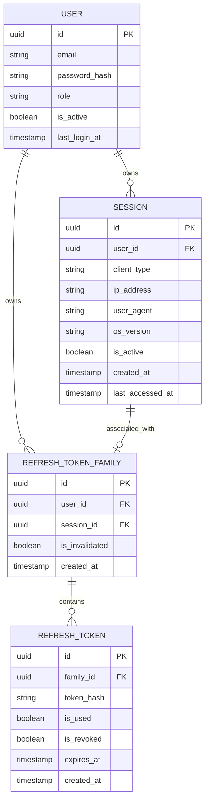
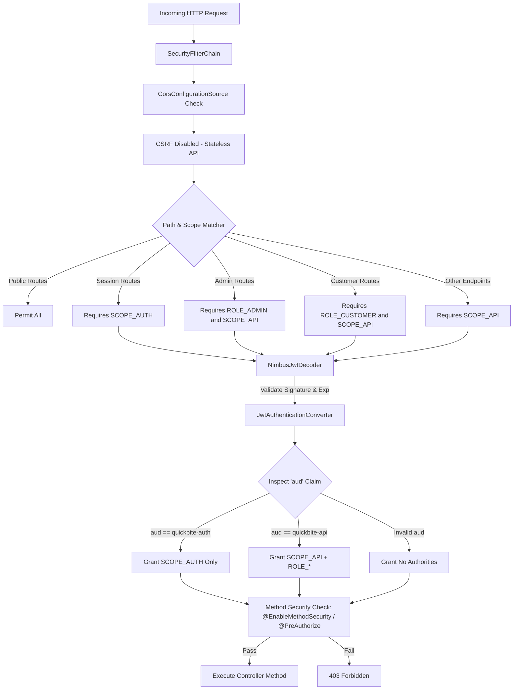
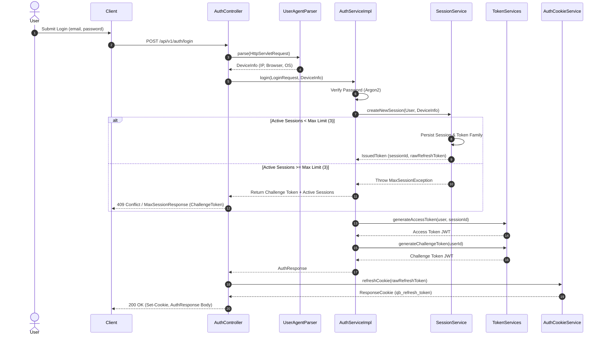
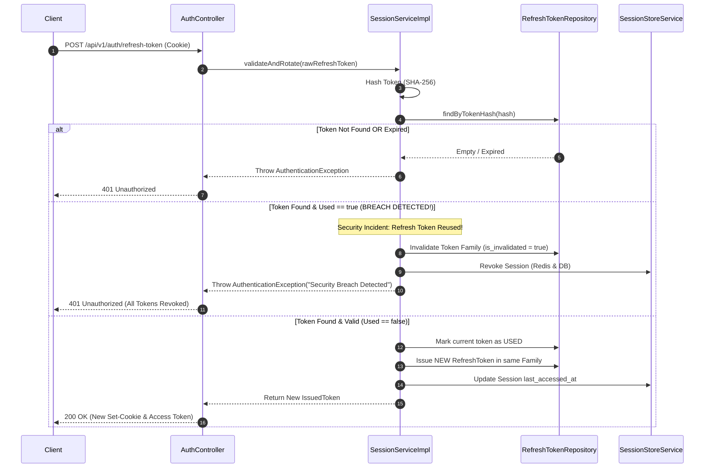
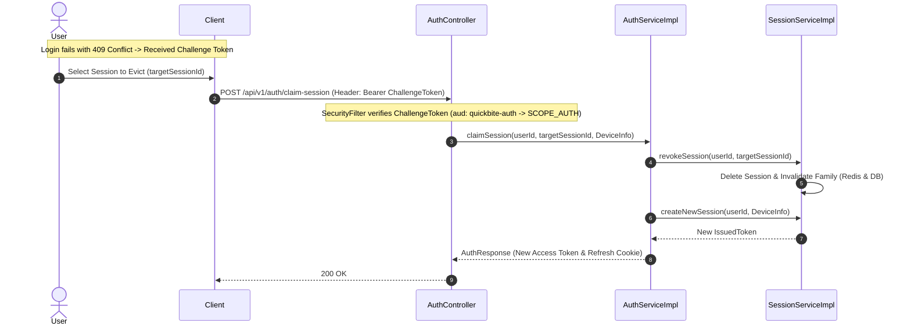

# QuickBite Authentication & Session Management Architecture

This document provides a comprehensive, production-grade architectural analysis of the `com.quickbite.quickbite.auth` package and its security infrastructure in QuickBite.

---

## 1. Executive Summary & Core Philosophy

QuickBite implements a **Hybrid Stateful-Session / Stateless-Token Authentication System** built natively on Spring Boot 4 / Java 25, Spring Security 6+, PostgreSQL, and Redis.

### Architectural Pillars
* **Self-Issued JWTs**: Acts as its own OAuth 2.0 Authorization Server and Resource Server using asymmetric RSA key pairs (2048-bit `private.pem` and `public.pem`).
* **Dual JWT Types**: Segregates business API access (`quickbite-api` audience) from session administrative access (`quickbite-auth` audience).
* **Token Rotation & Breach Detection**: Implements Refresh Token Families (`RefreshTokenFamily`). Using an already-rotated or reused refresh token triggers security breach protocol, instantly invalidating the entire family.
* **Dual-Layer Persistence**: Active session state is mirrored in **Redis** for fast, low-latency validation and **PostgreSQL** for audit compliance and long-term history.
* **XSS & CSRF Defense**: Long-lived refresh tokens are strictly transported via `HttpOnly`, `Secure`, `SameSite=Strict` cookies (`qb_refresh_token`).

---

## 2. Package & Component Structure

The `com.quickbite.quickbite.auth` domain is organized into distinct subpackages:

```
com.quickbite.quickbite.auth
├── controller
│   └── AuthController.java                      # REST Endpoints for Auth & Session management
├── dto
│   ├── AuthResponse.java                        # Response payload containing Access & Challenge tokens
│   ├── AuthenticatedSession.java                # Value object representing decoded (userId, sessionId)
│   ├── ClaimSessionRequest.java                 # Request payload for target session eviction
│   ├── DeviceInfo.java                          # Extracted client metadata (ip, browser, os, deviceType)
│   ├── IssuedToken.java                         # Internal DTO for minted token state
│   ├── LoginRequest.java / RegisterRequest.java # Authentication request DTOs
│   ├── MaxSessionResponse.java                  # Returned when concurrent session limit is hit
│   ├── RefreshRequest.java                      # Request payload for manual refresh token calls
│   └── SessionResponse.java                     # Public DTO for active session details
├── exception
│   ├── AuthenticationException.java             # Base domain exception (HTTP 401)
│   └── MaxSessionException.java                 # Thrown when session limit is breached (HTTP 409/400)
├── model
│   ├── ClientType.java                          # Enum (WEB, MOBILE_APP, TABLET, DESKTOP)
│   ├── RefreshToken.java                        # Individual refresh token entity
│   ├── RefreshTokenFamily.java                  # Aggregate root tracking token rotation lineage
│   └── Session.java                             # Active user session entity
├── repository
│   └── RefreshTokenRepository.java              # JPA repository for tokens & families
├── service
│   ├── AuthCookieService(Impl).java             # Manages HttpOnly refresh token cookies
│   ├── AuthService(Impl).java                   # Orchestrates authentication, registration, claim flows
│   ├── AuthenticatedSessionResolver(Impl).java  # Resolves (userId, sessionId) from Spring Security Jwt
│   ├── SessionService(Impl).java                # Core session lifecycle & rotation engine
│   ├── SessionStoreService.java                 # Abstraction for session persistence
│   ├── SessionRedisStoreService.java            # Redis implementation of session store
│   └── token
│       ├── AccessTokenService.java              # Mints and verifies API Access Tokens (PT15M)
│       ├── ChallengeTokenService.java           # Mints and verifies Session Challenge Tokens (PT5M)
│       ├── SpringSecurityTokenService.java      # Bridges TokenService with Spring Security's JwtEncoder
│       └── TokenService.java                    # Base token generation interface
└── util
    ├── TokenUtils.java                          # Cryptographic token generator (SHA-256 / SecureRandom)
    └── UserAgentParser.java                     # Spring @Component extracting DeviceInfo from HttpServletRequest
```

---

## 3. Domain Entity & Data Model

The data model enforces strict separation between an **active session**, the **token family**, and individual **refresh tokens**.



---

## 4. Token & Security Architecture

### 4.1 Token Specification Matrix

| Feature               | Access Token (AT)                | Challenge Token (CT)                                             | Refresh Token (RT)          |
|:----------------------|:---------------------------------|:-----------------------------------------------------------------|:----------------------------|
| **Format**            | Signed JWT (RSA256)              | Signed JWT (RSA256)                                              | Opaque Secure Random String |
| **Lifetime**          | 15 Minutes (`PT15M`)             | 5 Minutes (`PT5M`)                                               | 7 Days (`P7D`)              |
| **Audience (`aud`)**  | `quickbite-api`                  | `quickbite-auth`                                                 | N/A                         |
| **Granted Authority** | `SCOPE_API` + `ROLE_*`           | `SCOPE_AUTH`                                                     | N/A                         |
| **Transport**         | Header (`Authorization: Bearer`) | Header (`Authorization: Bearer` or `X-Session-Management-Token`) | Cookie (`qb_refresh_token`) |
| **Storage**           | Stateless (Memory)               | Stateless (Memory)                                               | Redis & PostgreSQL (Hashed) |

### 4.2 Spring Security Request Lifecycle



---

## 5. End-to-End Sequence Diagrams

### 5.1 User Authentication & Login Flow



---

### 5.2 Refresh Token Rotation & Reuse Breach Detection Flow

When a client presents a Refresh Token, the system rotates it. If an attacker attempts to reuse an old Refresh Token, breach detection triggers immediate revocation of all sessions.



---

### 5.3 Max Session Limit & Claim Session Flow

When a user reaches `maxConcurrentSessions` (default: 3), they must explicitly claim a session by evicting an old one using a **Challenge Token**.



---

## 6. Device & User-Agent Parsing Infrastructure

The `UserAgentParser` component extracts rich context from incoming requests to populate the `DeviceInfo` payload:

```java
public record DeviceInfo(
    String ipAddress,
    String browser,
    String osVersion,
    ClientType clientType
) {}
```

### Extraction Capabilities:
1. **IP Resolution**: Resolves client IP through proxy chains via `X-Forwarded-For`, falling back to `getRemoteAddr()`.
2. **User-Agent Parsing**: Uses `Yauaa` to identify:
   - Operating System & Version (e.g., `macOS 14.5`, `Android 13`).
   - Browser & Major Version (e.g., `Chrome 126`, `Safari 17`).
3. **Client Classification**: Maps raw device categories into `ClientType` (`WEB`, `MOBILE_APP`, `TABLET`, `DESKTOP`).

---

## 7. Security Best Practices & Hardening Verification

1. **Password Hashing**: `Argon2PasswordEncoder.defaultsForSpringSecurity_v5_8()` protecting against GPU/ASIC cracking attacks.
2. **HttpOnly & SameSite Cookie Transport**: Refresh tokens cannot be read by `document.cookie`, neutralizing XSS token theft.
3. **Audience-Based Token Isolation**: Challenge tokens (`quickbite-auth`) cannot access business APIs (`SCOPE_API`), and Access Tokens (`quickbite-api`) cannot perform session evictions (`SCOPE_AUTH`).
4. **Idempotent Revocation**: `/logout` and `/sessions/{id}` endpoints execute safely without throwing exceptions on repeat calls.
5. **Defense in Depth**: Spring Security filter chain acts as an outer perimeter while `@EnableMethodSecurity` and `@PreAuthorize` protect individual Java methods.
